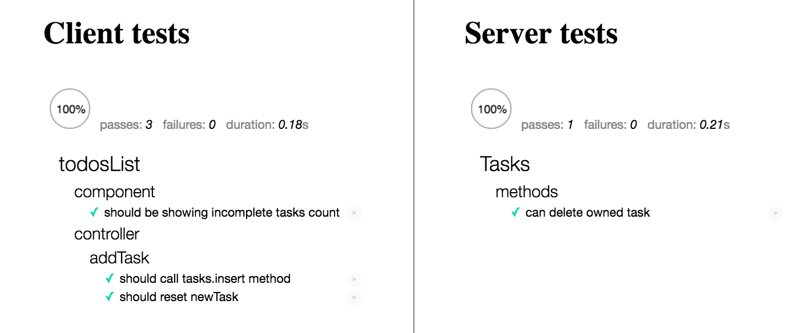
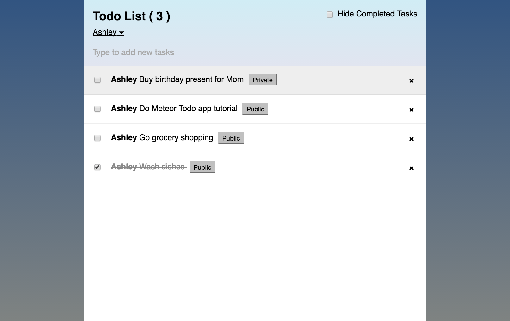

# Todo Meteor and Angular App
## By Ashley Maceli

## Description

A simple Meteor and Angular app to manage a 'to do' list with features such as creating user accounts with login and logout features. Users may add or delete tasks and check them off as completed. Tasks may also be filtered to show only incomplete tasks. Users may choose tasks to be labeled as public or private which makes them hidden to others. Tasks are stored in a MongoDB collection.

The Todo app from the Meteor tutorial - https://www.meteor.com/tutorials/angular/creating-an-app

## Known Bugs

No major bugs at this time.

## Running / Development

* `git clone https://github.com/AshleyRayMaceli/to-do-meteorjs` this repository
* change into the new directory then `cd simple-todos`
* run `npm install`
* enter the command `meteor` to run
* go to http://localhost:3000

## Technologies Used

JavaScript, Node.js, Meteor, Angular, MongoDB, Mocha, Chai

### Running Tests

* Run the command `meteor test --driver-package practicalmeteor:mocha`
* go to http://localhost:3000

### License

The MIT License (MIT)

Copyright (c) 2016 - Ashley Maceli

Permission is hereby granted, free of charge, to any person obtaining a copy
of this software and associated documentation files (the "Software"), to deal
in the Software without restriction, including without limitation the rights
to use, copy, modify, merge, publish, distribute, sublicense, and/or sell
copies of the Software, and to permit persons to whom the Software is
furnished to do so, subject to the following conditions:

The above copyright notice and this permission notice shall be included in all
copies or substantial portions of the Software.

THE SOFTWARE IS PROVIDED "AS IS", WITHOUT WARRANTY OF ANY KIND, EXPRESS OR
IMPLIED, INCLUDING BUT NOT LIMITED TO THE WARRANTIES OF MERCHANTABILITY,
FITNESS FOR A PARTICULAR PURPOSE AND NONINFRINGEMENT. IN NO EVENT SHALL THE
AUTHORS OR COPYRIGHT HOLDERS BE LIABLE FOR ANY CLAIM, DAMAGES OR OTHER
LIABILITY, WHETHER IN AN ACTION OF CONTRACT, TORT OR OTHERWISE, ARISING FROM,
OUT OF OR IN CONNECTION WITH THE SOFTWARE OR THE USE OR OTHER DEALINGS IN THE
SOFTWARE.
